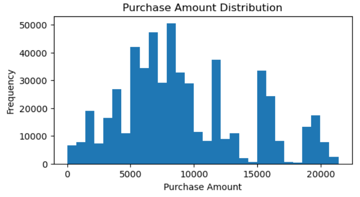
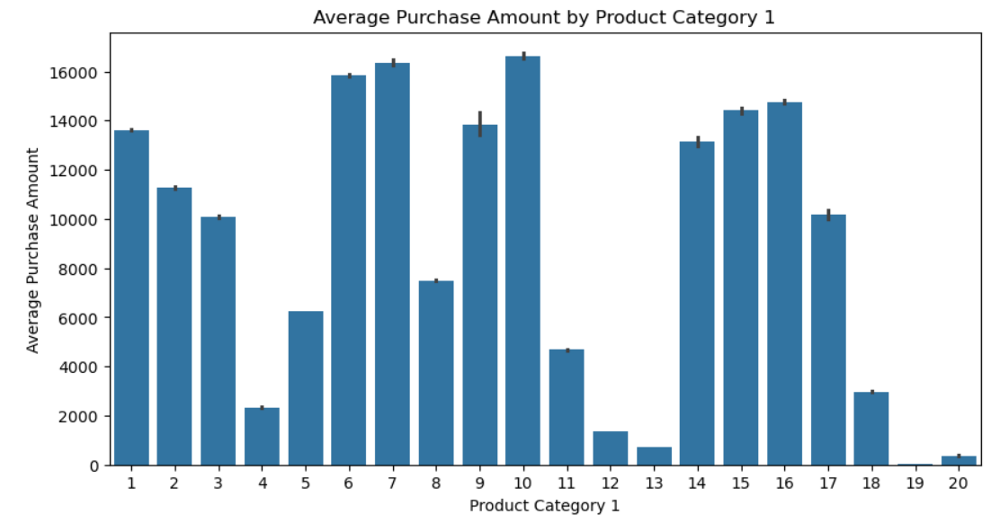
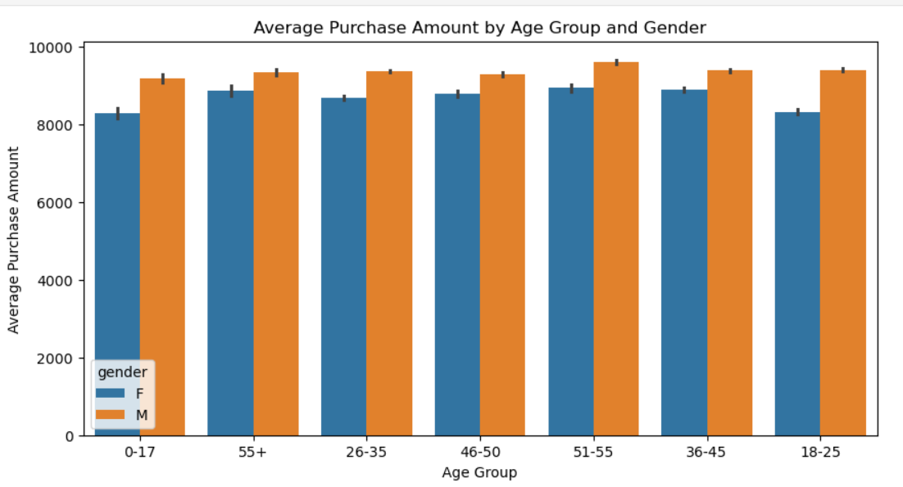

# Black Friday Sales Prediction – EDA Project

## 📌 Project Overview

This project focuses on Exploratory Data Analysis (EDA) of the Black Friday Sales dataset using Python.

The objective is to understand customer purchasing patterns and identify meaningful insights from sales data.

## 📊 Dataset Information

* **Dataset:** Black Friday Sales Dataset
* **Source:** [Kaggle Black Friday Sales Dataset](https://www.kaggle.com/datasets/shailx/black-friday-sales-dataset)
* **Records:** 550,068
* **Columns:** 12
* **Target Variable:** Purchase

## 🛠️ Technologies Used

* Python
* Pandas
* NumPy
* Matplotlib
* Seaborn
* Jupyter Notebook

## 🔍 Analysis Performed

* Data loading and understanding
* Data cleaning and preparation
* Missing value treatment
* Duplicate value checking
* Outlier detection and treatment
* Univariate analysis
* Bivariate analysis
* Multivariate analysis
* Pivot table analysis
* Business insights

## 📈 Key Insights

* Customer purchase patterns vary across age groups, genders, cities, and product categories.
* Male customers show higher average purchase amounts across the analyzed groups.
* City Category C shows higher average purchase amounts for both genders.
* Average purchase amounts differ across product categories.

## 📁 Project Files

* `Black_Friday_Sales_Prediction-EDA_Project.ipynb` – Jupyter Notebook containing the analysis.
* `EDA PPT - Black Friday Sales Prediction.pptx` – Project presentation.

## 📸 Project Screenshots

### 1. Purchase Amount Distribution

### 2. Average Purchase by Product Category

### 3. Multivariate Analysis – Age and Gender

## 💡 Skills Demonstrated

- Data Cleaning using Pandas
- Exploratory Data Analysis (EDA)
- Data Visualization using Matplotlib and Seaborn
- Missing Value Handling
- Outlier Detection and Treatment
- Pivot Table Analysis
- Data Interpretation and Business Insights

## 👩‍💻 Author

**Yuktha Polagani**

B.Tech Computer Science and Engineering Graduate
